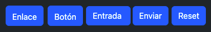
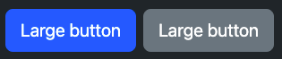
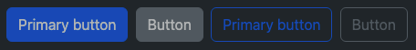
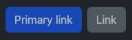
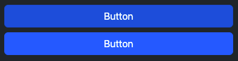
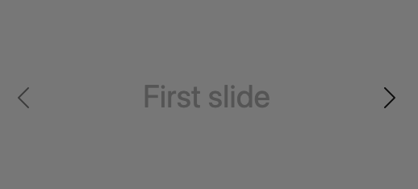
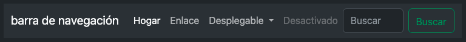
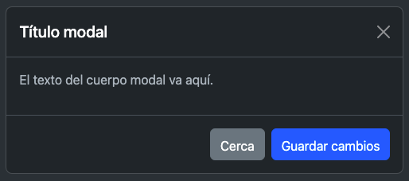
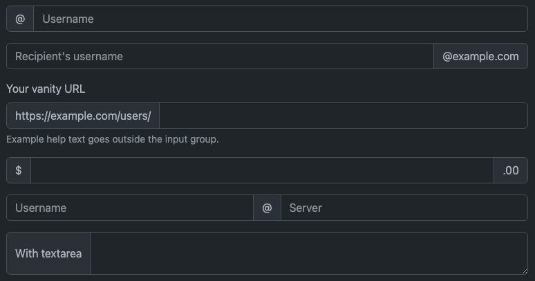
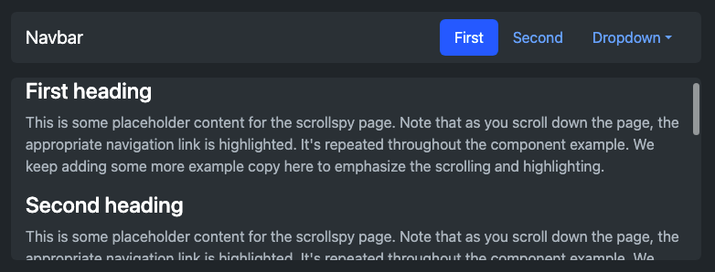

# Investigación - Bootstrap

*Archivo donde se van a recoger datos de investigacion sobre el framework de fornt-end Bootstrap.*

## **Preguntas sobre Bootstrap ❓**

### **¿Qué es Bootstrap? ¿Para qué sirve?**
---

Bootstrap es un marco front-end gratuito para un desarrollo web más rápido y fácil
    
Bootstrap incluye plantillas de diseño basadas en HTML y CSS para tipografía, formularios, botones, tablas, navegación, modales, carruseles de imágenes y muchos otros, así como complementos de JavaScript opcionales.
    
Bootstrap también le brinda la capacidad de crear fácilmente diseños receptivos

###  **¿Por qué usar Bootstrap?**
---
*--> Fácil de usar*   
Cualquier persona con conocimientos básicos de HTML y CSS puede comenzar a usar Bootstrap.

*--> Funciones receptivas*  
 El CSS receptivo de Bootstrap se ajusta a teléfonos, tabletas y computadoras de escritorio.

*--> Mobile first*  
 En Bootstrap, los estilos mobile first son parte del marco central.

*--> Compatibilidad con navegadores*  
  Bootstrap 5 es compatible con todos los navegadores modernos (Chrome, Firefox, Edge, Safari y Opera). 

### **Ventajas y desventajas de usar bootstrap**
---
**Ventajas de usar Bootstrap** ✅

  * Puedes diseñar una web jugando con sus elementos compuestos por diferentes combinaciones de HTML, CSS y Javascript.

  * Utiliza HTML5, CSS3, jQuery o GitHub, entre otros.

  * Incluye Grid system: muy útil para maquetar por columnas.

  * Sus plantillas son de sencilla adaptación responsive.

  * Se integra con librerías JavaScript.
  Usa Less: un lenguaje de las hojas de estilo CSS preparado para enriquecer los estilos de la web.

  * Cuenta con una documentación completa que te puede sacar de apuros rápidamente.

  * Facilita enormemente el diseño de interfaces y además incluye por defecto una plantilla bastante optimizada.

**Desventajas de usar Bootstrap**  ❌

  * Se recomienda trabajar con Bootstrap desde el inicio de un proyecto, ya que si quieres incluir el framework en un trabajo ya iniciado algunos estilos podrían «romperse» y se tendría que ajustar a como se tenia en un principio, y eso puede ser un poco tedioso y molesto.
    
  * Es complicado, cambiar de versión si has realizado modificaciones profundas.
    
  * No es ligero, y además, para algunas funcionalidades, será necesario tener que usar Javascript y jQuery.
    
  * Debes adaptar tu diseño a un grid de 12 columnas, que se modifican según el dispositivo. Aquí empiezan los problemas, Bootstrap por defecto te trae anchos, márgenes y altos de línea, y realizar cambios específicos.

### **Como instalar o implementar bootstrap en mi proyecto**
---
*1.* Cree un nuevo ```index.html``` archivo en la raíz de su proyecto. 
    
*2.* Incluya la ```<meta name="viewport"``` etiqueta también para un comportamiento receptivo adecuado en los dispositivos móviles.

```html
<!doctype html>
<html lang="en">
  <head>
    <meta charset="utf-8">
    <meta name="viewport" content="width=device-width, initial-scale=1">
    <title>Bootstrap demo</title>
  </head>
  <body>
    <h1>Hello, world!</h1>
  </body>
</html>
```
*3*. Incluye CSS y JS de Bootstrap. Coloque la ```<link>``` etiqueta en el ```<head>```para nuestro CSS y la ```<script>```etiqueta para nuestro paquete de JavaScript (incluido Popper para colocar menús desplegables, ventanas emergentes e información sobre herramientas) antes del cierre ```</body>```.

[Más información sobre los enlaces de CDN](https://getbootstrap.com/docs/5.3/getting-started/introduction/#cdn-links)

```html
<!doctype html>
<html lang="en">
  <head>
    <meta charset="utf-8">
    <meta name="viewport" content="width=device-width, initial-scale=1">
    <title>Bootstrap demo</title>
    <link href="https://cdn.jsdelivr.net/npm/bootstrap@5.3.0-alpha1/dist/css/bootstrap.min.css" rel="stylesheet" integrity="sha384-GLhlTQ8iRABdZLl6O3oVMWSktQOp6b7In1Zl3/Jr59b6EGGoI1aFkw7cmDA6j6gD" crossorigin="anonymous">
  </head>
  <body>
    <h1>Hello, world!</h1>
    <script src="https://cdn.jsdelivr.net/npm/bootstrap@5.3.0-alpha1/dist/js/bootstrap.bundle.min.js" integrity="sha384-w76AqPfDkMBDXo30jS1Sgez6pr3x5MlQ1ZAGC+nuZB+EYdgRZgiwxhTBTkF7CXvN" crossorigin="anonymous"></script>
  </body>
</html>
```
*Se pueden descargar la colección de archivos para poder meterlos en el propio directorio e insertarlos mediante una ruta relativa de directorios.*

[Descargar coleccion de archivos](https://getbootstrap.com/docs/5.3/getting-started/download/)

### **¿Se puede implementar responsive con Bootstrap? Si es asi podrías explicar como funciona y poner un ejemplo**
---
Esencialmente Bootstrap está formado por una colección de hojas de estilo y funciones javascript auxiliares que permiten construir muy rápidamente un front-end responsive. Está pensado para trabajar bajo el concepto “mobile first”, es decir, diseñar pensando ante todo en los dispositivos móviles.

**Ejemplo**
   
*--> Imágenes responsive*
    
Las imágenes en Bootstrap se hacen responsivas con ```.img-fluid```. Esto se aplica ```max-width: 100%; a height: auto;``` la imagen para que se escale con el ancho principal.
    
  

```html

```

### **¿Que es un componente de bootstrap? Pon un ejemplo**
---
Bootstrap nos da la posibilidad de utilizar diferentes componentes, que no son más que partes de código ya programados que podemos insertar en nuestros proyectos. 
    
Por ejemplo: *menús de navegación, carousels y tablas de precios, entre otros.* 

**Ejemplo**

*--> Card*  

Es un contenedor de contenido flexible y extensible. Incluye opciones para encabezados y pies de página, una amplia variedad de contenido, colores de fondo contextuales y potentes opciones de visualización.


```html
<div class="card" style="width: 18rem;">
  
  <div class="card-body">
    <h5 class="card-title">Card title</h5>
    <p class="card-text">Some quick example text to build on the card title and make up the bulk of the card's content.</p>
    <a href="#" class="btn btn-primary">Go somewhere</a>
  </div>
</div>
```
### **¿Hay muchos tipos de diseños en Bootstrap? Si los hay, explícalos** 
--- 
  * *Diseño fluido*    

Utiliza la clase bootstrap .container-fluid para el diseño. Este diseño utiliza valores proporcionales, como unidades de medida para un bloque de contenido, imágenes o cualquier otro elemento. Se utiliza para crear un elemento que sea 100 % más ancho y cubra todos los anchos de la pantalla. El diseño fluido cambia de tamaño continuamente a medida que cambia el ancho de su navegador en cualquier cantidad.

* *Diseño fijo*
     
Utiliza la clase bootstrap .container para el diseño. El diseño fijo tiene valores de ancho de píxel específicos que cambian su valor de ancho con la ayuda de consultas de medios. Proporciona un contenedor receptivo de ancho fijo. El diseño fijo cambia de tamaño en fragmentos en varios anchos determinados a medida que se especifican los valores de píxeles.

### **¿Cuáles son los diferentes tipos de botones en bootstrap? Pon ejemplos.** 
---- 
*--> Button Tag*

Las ```.btn``` clases están diseñadas para ser utilizadas con el ```<button>``` elemento. Sin embargo, también puede usar estas clases en elementos ```<a>``` o ```<input>``` (aunque algunos navegadores pueden aplicar una representación ligeramente diferente).



```html
<a class="btn btn-primary" href="#" role="button">Link</a>
<button class="btn btn-primary" type="submit">Button</button>
<input class="btn btn-primary" type="button" value="Input">
<input class="btn btn-primary" type="submit" value="Submit">
<input class="btn btn-primary" type="reset" value="Reset">
```
*--> Outline buttons* 

¿Necesita un botón, pero no los fuertes colores de fondo que traen?   
Reemplace las clases de modificador predeterminadas con las ```.btn-outline-*``` que eliminan todas las imágenes y colores de fondo en cualquier botón.


```html
<button type="button" class="btn btn-outline-primary">Primary</button>
<button type="button" class="btn btn-outline-secondary">Secondary</button>
<button type="button" class="btn btn-outline-success">Success</button>
<button type="button" class="btn btn-outline-danger">Danger</button>
<button type="button" class="btn btn-outline-warning">Warning</button>
<button type="button" class="btn btn-outline-info">Info</button>
<button type="button" class="btn btn-outline-light">Light</button>
<button type="button" class="btn btn-outline-dark">Dark</button>
```

*--> Sizes*

¿Te apetece botones más grandes o más pequeños?   
Añadir ```.btn-lgo .btn-smpara``` tamaños adicionales.
    


```html
<button type="button" class="btn btn-primary btn-lg">Large button</button>
<button type="button" class="btn btn-secondary btn-lg">Large button</button>
```


*--> Disabled state button*

Haga que los botones parezcan inactivos agregando el disabled atributo booleano a cualquier ```'<buton> elemento'```. Se han aplicado botones deshabilitados ```pointer-events: none```, lo que evita que se activen los estados activos y de desplazamiento.




```html
<button type="button" class="btn btn-primary" disabled>Primary button</button>
<button type="button" class="btn btn-secondary" disabled>Button</button>
<button type="button" class="btn btn-outline-primary" disabled>Primary button</button>
<button type="button" class="btn btn-outline-secondary" disabled>Button</button>
```

*--> Link functionality caveat*

Para cubrir los casos en los que debe mantener el href atributo en un enlace deshabilitado, la ```.disabled``` clase usa ```pointer-events: none``` para intentar deshabilitar la funcionalidad de enlace de ```<a>```. Tenga en cuenta que esta propiedad CSS aún no está estandarizada para HTML, pero todos los navegadores modernos la admiten. 

Además, incluso en los navegadores compatibles ```pointer-events: none```, la navegación con el teclado no se ve afectada, lo que significa que los usuarios de teclados videntes y los usuarios de tecnologías de asistencia aún podrán activar estos enlaces. 

Entonces, para estar seguro, además de ```aria-disabled="true"```, también incluya un ```tabindex="-1"```atributo en estos enlaces para evitar que reciban el foco del teclado y use JavaScript personalizado para deshabilitar su funcionalidad por completo.



```html
<a href="#" class="btn btn-primary disabled" tabindex="-1" role="button" aria-disabled="true">Primary link</a>
<a href="#" class="btn btn-secondary disabled" tabindex="-1" role="button" aria-disabled="true">Link</a>
```

*--> Block buttons*

Cree pilas receptivas de ```"botones de bloque"``` de ancho completo como los de Bootstrap 4 con una combinación de nuestras utilidades de visualización y espacios. Al usar utilidades en lugar de clases específicas de botones, tenemos un control mucho mayor sobre el espaciado, la alineación y los comportamientos de respuesta.




```html
<div class="d-grid gap-2">
  <button class="btn btn-primary" type="button">Button</button>
  <button class="btn btn-primary" type="button">Button</button>
</div>
```

### **¿Que es un Carousel de bootstrap? Pon un ejemplo**
---

    
Es una presentación de diapositivas para recorrer una serie de contenido, creado con transformaciones CSS 3D y un poco de JavaScript. Funciona con una serie de imágenes, texto o marcas personalizadas. También incluye soporte para controles e indicadores anteriores/siguientes.

**Ejemplo**
    
Aquí hay un ejemplo básico de un carousel con tres diapositivas. Tenga en cuenta los controles anterior/siguiente. Recomendamos usar ```<buton>```elementos, pero también puede usar ```<a>``` elementos con ```role="button"```.



```html
<div id="carouselExample" class="carousel slide">
  <div class="carousel-inner">
    <div class="carousel-item active">
      
    </div>
    <div class="carousel-item">
      
    </div>
    <div class="carousel-item">
      
    </div>
  </div>
  <button class="carousel-control-prev" type="button" data-bs-target="#carouselExample" data-bs-slide="prev">
    <span class="carousel-control-prev-icon" aria-hidden="true"></span>
    <span class="visually-hidden">Previous</span>
  </button>
  <button class="carousel-control-next" type="button" data-bs-target="#carouselExample" data-bs-slide="next">
    <span class="carousel-control-next-icon" aria-hidden="true"></span>
    <span class="visually-hidden">Next</span>
  </button>
</div>
```
### **¿Que es un spinner de bootstrap? Pon un ejemplo**
---      
Indica el estado de carga de un componente o una página con los indicadores giratorios de Bootstrap, creados completamente con HTML, CSS y sin JavaScript.

**Ejemplo**

El control giratorio de borde utiliza currentColor para su ```border-color```, lo que significa que puede personalizar el color con utilidades de color de texto. Puede usar cualquiera de nuestras utilidades de color de texto en la rueda giratoria estándar.

  

```html
<div class="spinner-border text-primary" role="status">
  <span class="visually-hidden">Loading...</span>
</div>
<div class="spinner-border text-secondary" role="status">
  <span class="visually-hidden">Loading...</span>
</div>
<div class="spinner-border text-success" role="status">
  <span class="visually-hidden">Loading...</span>
</div>
<div class="spinner-border text-danger" role="status">
  <span class="visually-hidden">Loading...</span>
</div>
<div class="spinner-border text-warning" role="status">
  <span class="visually-hidden">Loading...</span>
</div>
<div class="spinner-border text-info" role="status">
  <span class="visually-hidden">Loading...</span>
</div>
<div class="spinner-border text-light" role="status">
  <span class="visually-hidden">Loading...</span>
</div>
<div class="spinner-border text-dark" role="status">
  <span class="visually-hidden">Loading...</span>
</div>
```

### **¿Que es un navBar de bootstrap? Pon un ejemplo**
---
Es el potente encabezado de navegación sensible de Bootstrap. Incluye soporte para marca, navegación y más, incluido soporte para nuestro complemento de colapso.

**Ejemplo**

Este es un ejemplo de todos los subcomponentes incluidos en una barra de navegación receptiva con un tema de luz que colapsa automáticamente en el ```lg``` brackpoint (large).



```html
<nav class="navbar navbar-expand-lg bg-body-tertiary">
  <div class="container-fluid">
    <a class="navbar-brand" href="#">Navbar</a>
    <button class="navbar-toggler" type="button" data-bs-toggle="collapse" data-bs-target="#navbarSupportedContent" aria-controls="navbarSupportedContent" aria-expanded="false" aria-label="Toggle navigation">
      <span class="navbar-toggler-icon"></span>
    </button>
    <div class="collapse navbar-collapse" id="navbarSupportedContent">
      <ul class="navbar-nav me-auto mb-2 mb-lg-0">
        <li class="nav-item">
          <a class="nav-link active" aria-current="page" href="#">Home</a>
        </li>
        <li class="nav-item">
          <a class="nav-link" href="#">Link</a>
        </li>
        <li class="nav-item dropdown">
          <a class="nav-link dropdown-toggle" href="#" role="button" data-bs-toggle="dropdown" aria-expanded="false">
            Dropdown
          </a>
          <ul class="dropdown-menu">
            <li><a class="dropdown-item" href="#">Action</a></li>
            <li><a class="dropdown-item" href="#">Another action</a></li>
            <li><hr class="dropdown-divider"></li>
            <li><a class="dropdown-item" href="#">Something else here</a></li>
          </ul>
        </li>
        <li class="nav-item">
          <a class="nav-link disabled">Disabled</a>
        </li>
      </ul>
      <form class="d-flex" role="search">
        <input class="form-control me-2" type="search" placeholder="Search" aria-label="Search">
        <button class="btn btn-outline-success" type="submit">Search</button>
      </form>
    </div>
  </div>
</nav>
```
### **¿Que es un modal de bootstrap? Pon un ejemplo**
---
Es un complemento de JavaScript de Bootstrap para agregar cuadros de diálogo a su sitio para cajas de luz, notificaciones de usuario o contenido completamente personalizado.

**Ejemplo**

A continuación se muestra un ejemplo modal estático ```position``` (lo que significa que ```display``` ha sido anulado). Se incluyen el encabezado modal, el cuerpo modal (obligatorio para ```padding```) y el pie de página modal (opcional). Le pedimos que incluya encabezados modales con acciones de descarte siempre que sea posible, o proporcione otra acción de descarte explícita.



```html
<div class="modal" tabindex="-1">
  <div class="modal-dialog">
    <div class="modal-content">
      <div class="modal-header">
        <h5 class="modal-title">Modal title</h5>
        <button type="button" class="btn-close" data-bs-dismiss="modal" aria-label="Close"></button>
      </div>
      <div class="modal-body">
        <p>Modal body text goes here.</p>
      </div>
      <div class="modal-footer">
        <button type="button" class="btn btn-secondary" data-bs-dismiss="modal">Close</button>
        <button type="button" class="btn btn-primary">Save changes</button>
      </div>
    </div>
  </div>
</div>
```

### **¿Existen inputs para subir archivos en Bootstrap? Pon un ejemplo**
---
En bootstrap existen varios tipos de Inputs Group, estos inputs incluyen soporte para selecciones personalizadas y entradas de archivos personalizados. Las versiones predeterminadas del navegador de estos no son compatibles.

**Ejemplo**

Coloque un complemento o botón a cada lado de una entrada. También puede colocar uno a ambos lados de una entrada. Recuerde colocar ```<label>``` fuera del grupo de entrada.



```html
<div class="input-group mb-3">
  <label class="input-group-text" for="inputGroupFile01">Upload</label>
  <input type="file" class="form-control" id="inputGroupFile01">
</div>

<div class="input-group mb-3">
  <input type="file" class="form-control" id="inputGroupFile02">
  <label class="input-group-text" for="inputGroupFile02">Upload</label>
</div>

<div class="input-group mb-3">
  <button class="btn btn-outline-secondary" type="button" id="inputGroupFileAddon03">Button</button>
  <input type="file" class="form-control" id="inputGroupFile03" aria-describedby="inputGroupFileAddon03" aria-label="Upload">
</div>

<div class="input-group">
  <input type="file" class="form-control" id="inputGroupFile04" aria-describedby="inputGroupFileAddon04" aria-label="Upload">
  <button class="btn btn-outline-secondary" type="button" id="inputGroupFileAddon04">Button</button>
</div>
```

### **¿Qué es un plugin scrollspy en Bootstrap? Pon un ejemplo**
---
Es un componente que permite actualizar automáticamente la navegación de Bootstrap y/o enumerar los componentes del grupo en función de la posición de desplazamiento para indicar qué enlace está actualmente activo en la ventana gráfica.

**Ejemplo**

*--> Barra de navegación*

Desplácese por el área debajo de la barra de navegación y observe cómo cambia la clase activa. Abra el menú desplegable y observe cómo se resaltan también los elementos desplegables.



```html
<nav id="navbar-example2" class="navbar bg-body-tertiary px-3 mb-3">
  <a class="navbar-brand" href="#">Navbar</a>
  <ul class="nav nav-pills">
    <li class="nav-item">
      <a class="nav-link" href="#scrollspyHeading1">First</a>
    </li>
    <li class="nav-item">
      <a class="nav-link" href="#scrollspyHeading2">Second</a>
    </li>
    <li class="nav-item dropdown">
      <a class="nav-link dropdown-toggle" data-bs-toggle="dropdown" href="#" role="button" aria-expanded="false">Dropdown</a>
      <ul class="dropdown-menu">
        <li><a class="dropdown-item" href="#scrollspyHeading3">Third</a></li>
        <li><a class="dropdown-item" href="#scrollspyHeading4">Fourth</a></li>
        <li><hr class="dropdown-divider"></li>
        <li><a class="dropdown-item" href="#scrollspyHeading5">Fifth</a></li>
      </ul>
    </li>
  </ul>
</nav>
<div data-bs-spy="scroll" data-bs-target="#navbar-example2" data-bs-root-margin="0px 0px -40%" data-bs-smooth-scroll="true" class="scrollspy-example bg-body-tertiary p-3 rounded-2" tabindex="0">
  <h4 id="scrollspyHeading1">First heading</h4>
  <p>...</p>
  <h4 id="scrollspyHeading2">Second heading</h4>
  <p>...</p>
  <h4 id="scrollspyHeading3">Third heading</h4>
  <p>...</p>
  <h4 id="scrollspyHeading4">Fourth heading</h4>
  <p>...</p>
  <h4 id="scrollspyHeading5">Fifth heading</h4>
  <p>...</p>
</div>
```

## Construido con 🛠️

* [Bootstrap](https://getbootstrap-com.translate.goog/?_x_tr_sl=en&_x_tr_tl=es&_x_tr_hl=es&_x_tr_pto=sc) - Framework front-end
* [Visual Studio Code](https://code.visualstudio.com/) - Editor de código usado


## Autores ✒️

* Ismael Cervera - [amsiceza](https://github.com/amsiceza)
* Jose Llanas - [jllanas1986](https://github.com/jllanas1986)

